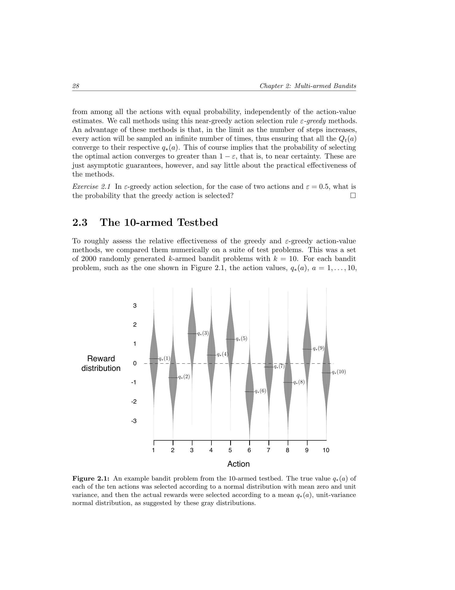
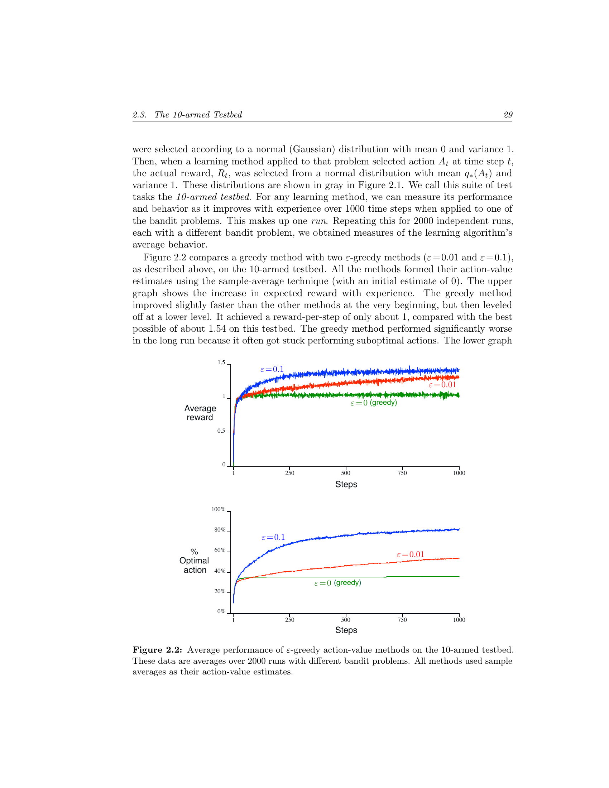
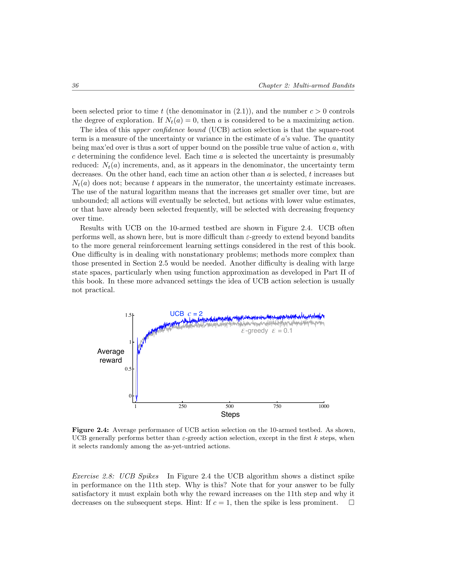
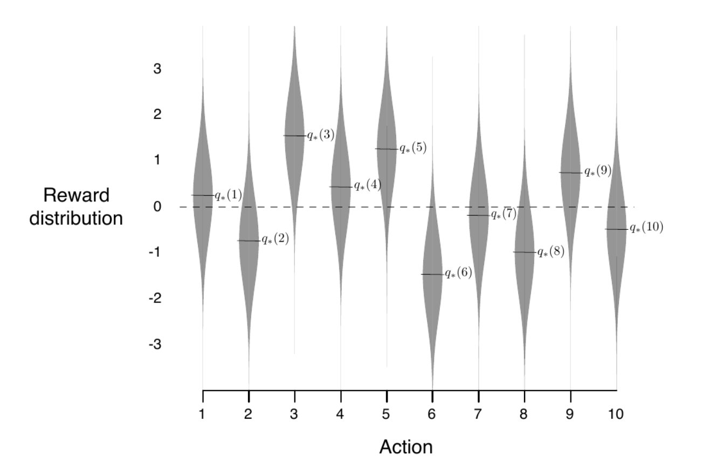
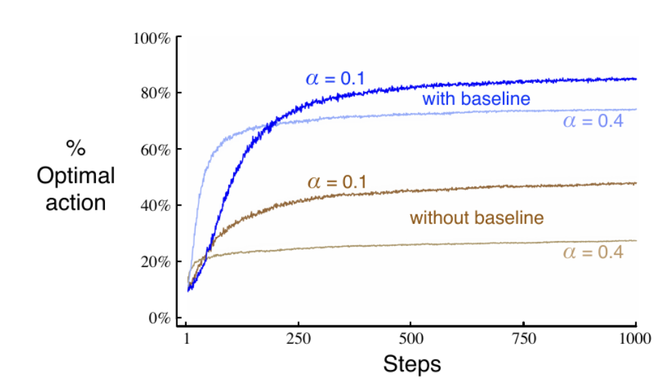

# Chapter 2: Multi-armed Bandits — Textbook Roadmap

**Source**: Sutton & Barto, *Reinforcement Learning: An Introduction* (2nd ed.), pp. 25–42

**Chapter theme**: The simplest RL setting — no state, no transitions. Just repeated action selection and reward. Isolates the **exploration vs. exploitation** tradeoff.

---

## 2.1 A k-Armed Bandit Problem (pp. 25–26)

**Setup**:
- $k$ actions, each with an unknown expected reward $q_{\ast}(a) = \mathbb{E}[R_t \mid A_t = a]$
- Agent forms estimates $Q_t(a)$ and must balance exploring unknown actions vs. exploiting the current best
- **Greedy** actions: $A_t = \arg\max_a Q_t(a)$

**Learning outcomes**:
- Define the k-armed bandit problem and its components (actions, rewards, values)
- Distinguish between action *value* $q_{\ast}(a)$ and action-value *estimate* $Q_t(a)$
- Articulate the explore/exploit dilemma: why neither pure strategy works

---

## 2.2 Action-value Methods (pp. 27–29)

**Key ideas**:
- **Sample-average** estimator: $Q_t(a) = \frac{\text{sum of rewards from action } a}{\text{number of times } a \text{ taken}}$
- **Greedy** selection: always pick $\arg\max_a Q_t(a)$
- **Epsilon-greedy**: with probability $\varepsilon$ pick random action, otherwise greedy
- Greedy can get stuck on suboptimal actions; $\varepsilon$-greedy guarantees all actions sampled infinitely often

**Learning outcomes**:
- Compute sample-average estimates from a sequence of rewards
- Explain why greedy selection alone can fail
- Describe $\varepsilon$-greedy and the role of $\varepsilon$ in controlling exploration

---

## 2.3 The 10-Armed Testbed (pp. 28–29)

**Experimental setup**:
- 2000 randomly generated 10-armed bandit problems
- True values $q_{\ast}(a) \sim \mathcal{N}(0, 1)$; rewards $\sim \mathcal{N}(q_{\ast}(a), 1)$
- Compared: greedy ($\varepsilon = 0$), $\varepsilon = 0.01$, $\varepsilon = 0.1$ over 1000 steps

**Figures**:

*Figure 2.1 — Violin plot of a single 10-armed testbed instance showing $q_{\ast}(a)$ distributions:*

*Figure 2.2 — Two-panel: average reward and % optimal action over 1000 steps:*

**Key results**:
- Greedy improves faster initially but plateaus at $\sim 1.0$ (gets stuck)
- $\varepsilon = 0.1$ explores fast, converges to $\sim 1.55$ but keeps exploring suboptimally
- $\varepsilon = 0.01$ explores slowly but eventually surpasses $\varepsilon = 0.1$
- Advantage of $\varepsilon$-greedy grows with reward noise; shrinks with zero noise (but greedy still risks getting stuck)

**Learning outcomes**:
- Interpret testbed-style averaged learning curves
- Explain why greedy plateaus and why the two $\varepsilon$ values cross
- Recognize that the "best" $\varepsilon$ depends on the task and time horizon

---

## 2.4 Incremental Implementation (pp. 30–31)

**Key ideas**:
- Derive incremental update from sample average (avoid storing all rewards):

$$Q_{n+1} = Q_n + \frac{1}{n}\big[R_n - Q_n\big]$$

- General form: $\text{NewEstimate} = \text{OldEstimate} + \text{StepSize} \cdot [\text{Target} - \text{OldEstimate}]$
- $[R_n - Q_n]$ is the *error* in the estimate; step size $\frac{1}{n}$ shrinks over time

**Pseudocode**: "A simple bandit algorithm" (p. 32) — full loop of action selection + incremental update

**Learning outcomes**:
- Derive the incremental update rule from the sample-average definition
- Identify the three components: current estimate, step size, error
- Explain why this is memory-efficient ($O(1)$ per action vs. storing all rewards)

---

## 2.5 Tracking a Nonstationary Problem (pp. 32–34)

**Key ideas**:
- When true values change over time, sample-average ($\frac{1}{n}$) weights all rewards equally — too slow to adapt
- **Constant step-size** $\alpha$:

$$Q_{n+1} = Q_n + \alpha\big[R_n - Q_n\big]$$

- This gives an **exponential recency-weighted average** (Eq. 2.6):

$$Q_{n+1} = (1 - \alpha)^n Q_1 + \sum_{i=1}^{n} \alpha(1-\alpha)^{n-i} R_i$$

- Recent rewards weighted more, old rewards decay by $(1 - \alpha)^n$
- **Convergence conditions** (Eq. 2.7):

$$\sum_{n=1}^{\infty} \alpha_n = \infty \qquad \text{and} \qquad \sum_{n=1}^{\infty} \alpha_n^2 < \infty$$

- Sample-average ($\frac{1}{n}$) satisfies both; constant $\alpha$ satisfies only the first (never fully converges — appropriate for nonstationary)

**Learning outcomes**:
- Explain why sample-average fails in nonstationary environments
- Show how constant $\alpha$ produces exponential recency weighting
- State the two convergence conditions and which methods satisfy them

---

## 2.6 Optimistic Initial Values (pp. 34–36)

**Key ideas**:
- All methods so far are biased by initial $Q_0(a)$
- **Optimistic initialization**: set $Q_0 = +5$ (much higher than true values $\sim \mathcal{N}(0,1)$)
- Effect: every action "disappoints" early on, forcing systematic exploration even under greedy selection
- Limitation: only useful for stationary problems (the exploration boost is temporary)

*Figure 2.3 — Optimistic greedy ($Q_0=5$, $\varepsilon=0$) vs. realistic $\varepsilon$-greedy ($Q_0=0$, $\varepsilon=0.1$):*

**Learning outcomes**:
- Explain the mechanism: high initial values $\to$ disappointment $\to$ forced exploration
- Recognize this as a simple trick that drives early exploration without $\varepsilon$
- Identify the limitation: not useful for nonstationary problems (one-time trick)

---

## 2.7 Upper-Confidence-Bound Action Selection (pp. 35–36)

**Key ideas**:
- $\varepsilon$-greedy explores **blindly** (random among non-greedy actions)
- **UCB** explores **intelligently** — favors actions with uncertain value estimates:

$$A_t = \arg\max_a \left[ Q_t(a) + c\sqrt{\frac{\ln t}{N_t(a)}} \right]$$

- The $\sqrt{}$ term is the **uncertainty bonus**: large when action $a$ is rarely tried, shrinks with more samples
- $c$ controls exploration degree; $\ln t$ ensures all actions are tried but less frequently over time

*Figure 2.4 — UCB ($c=2$) vs. $\varepsilon$-greedy ($\varepsilon=0.1$):*

**Learning outcomes**:
- Parse the UCB formula: exploitation term ($Q$) + exploration term (uncertainty bonus)
- Explain why UCB is more targeted than $\varepsilon$-greedy
- Identify limitations noted in text: harder to extend to nonstationary or large state spaces

---

## 2.8 Gradient Bandit Algorithms (pp. 37–40)

**Key ideas**:
- Instead of estimating values, learn a **preference** $H_t(a)$ for each action
- Action probabilities via **softmax**:

$$\pi_t(a) = \frac{e^{H_t(a)}}{\sum_{b=1}^{k} e^{H_t(b)}}$$

- Update rule (gradient ascent on expected reward):

$$H_{t+1}(A_t) = H_t(A_t) + \alpha(R_t - \bar{R}_t)(1 - \pi_t(A_t)) \qquad \text{(selected action)}$$

$$H_{t+1}(a) = H_t(a) - \alpha(R_t - \bar{R}_t)\pi_t(a) \qquad \text{(all other actions)}$$

- **Baseline** $\bar{R}_t$ (average of past rewards): rewards above baseline increase preference, below decrease it
- Without baseline, performance degrades significantly

*Figure 2.5 — % optimal action for gradient bandit: with/without baseline, $\alpha=0.1$ vs. $\alpha=0.4$:*

**Textbook note**: Section includes a proof (pp. 38–40) that this update is stochastic gradient ascent on $\mathbb{E}[R_t]$.

**Learning outcomes**:
- Distinguish preferences (relative, arbitrary scale) from value estimates (absolute)
- Explain the softmax action-selection rule
- Describe the role of the baseline and why omitting it hurts performance
- Understand the gradient ascent interpretation at a high level

---

## 2.9 Associative Search / Contextual Bandits (p. 41)

**Key ideas**:
- All prior sections: **nonassociative** — same situation every step
- **Associative search**: the best action depends on some observable **context/state**
- This is the "contextual bandit" — intermediate between k-armed bandits and full RL
- Full RL adds one more thing: actions affect the next state (not just the reward)

**Learning outcomes**:
- Distinguish nonassociative (bandit) from associative (contextual bandit) settings
- Explain why context changes the problem: must learn a mapping from situations to actions
- Position contextual bandits between bandits and full RL on the complexity spectrum

---

## 2.10 Summary (pp. 42–43)

**Key ideas**:
- All methods have a tunable parameter; all have a "sweet spot" (inverted-U performance curves)
- Parameter study compares all methods on a single plot: x-axis = parameter value (log scale), y-axis = average reward over first 1000 steps

*Figure 2.6 — Parameter study across all chapter methods:*

**Methods compared**: $\varepsilon$-greedy, gradient bandit, UCB, optimistic greedy

**Key takeaway**: UCB performs best on this testbed, but all methods are sensitive to their parameter. More sophisticated does not mean universally better.

**Learning outcomes**:
- Read and interpret a parameter-study plot
- Recognize that all exploration methods have a tuning parameter with diminishing returns at extremes
- Appreciate that method choice depends on problem characteristics (stationarity, noise, state space)

---

## Key Equations Reference

| Eq. | Name | Formula |
|-----|------|---------|
| 2.1 | Sample average | $Q_t(a) = \frac{\sum_{i=1}^{t-1} R_i \cdot \mathbb{1}_{A_i=a}}{\sum_{i=1}^{t-1} \mathbb{1}_{A_i=a}}$ |
| 2.3 | Incremental update | $Q_{n+1} = Q_n + \frac{1}{n}[R_n - Q_n]$ |
| 2.5 | Constant step-size | $Q_{n+1} = Q_n + \alpha[R_n - Q_n]$ |
| 2.6 | Recency-weighted avg | $Q_{n+1} = (1-\alpha)^n Q_1 + \sum_{i=1}^{n} \alpha(1-\alpha)^{n-i} R_i$ |
| 2.7 | Convergence conditions | $\sum \alpha_n = \infty, \quad \sum \alpha_n^2 < \infty$ |
| 2.10 | UCB | $A_t = \arg\max_a \left[ Q_t(a) + c\sqrt{\frac{\ln t}{N_t(a)}} \right]$ |
| 2.12 | Gradient update | $H_{t+1}(A_t) = H_t(A_t) + \alpha(R_t - \bar{R}_t)(1 - \pi_t(A_t))$ |
